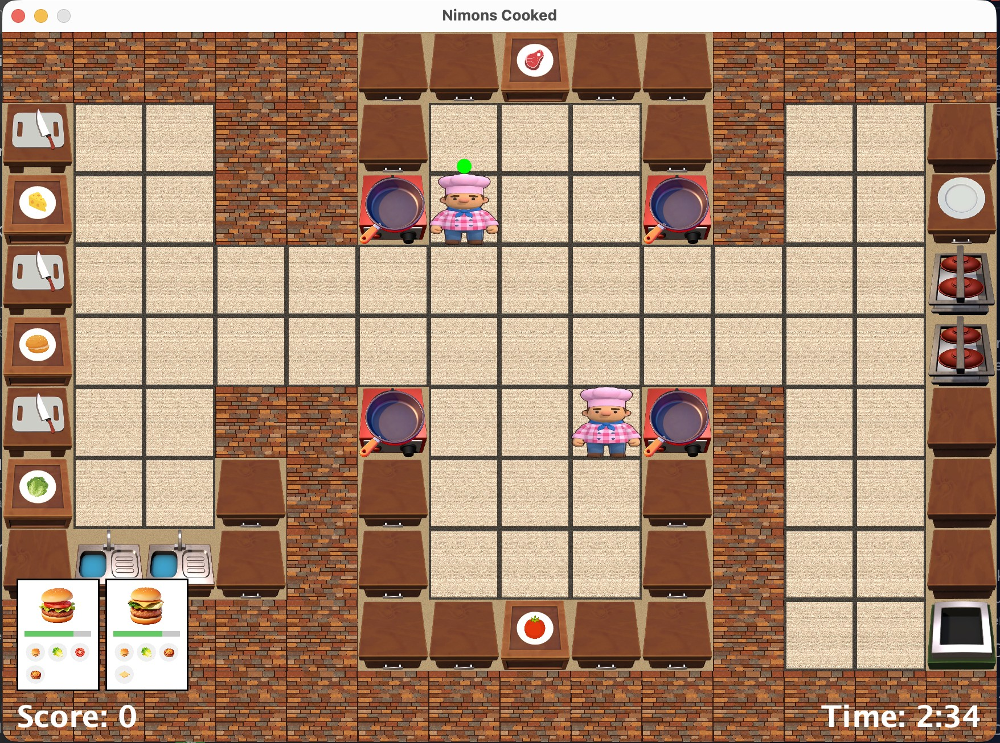

# Tubes_OOP
# 🍔 Nimonscooked


**Nimonscooked** adalah permainan simulasi memasak *chaotic* berbasis Java yang terinspirasi dari game populer *Overcooked!*. Pemain mengontrol dua koki untuk menyiapkan, memasak, dan menyajikan pesanan burger yang kompleks dalam batas waktu yang ditentukan.

Hati-hati! Dapur ini penuh tekanan. Jangan biarkan daging gosong, piring kotor menumpuk, atau pesanan kadaluarsa!

---

## Gameplay



---

## Fitur Utama

### 🎮 Gameplay Mechanics
* **Dual Chef Control:** Kendalikan dua koki (Kebin & Stewart) secara bergantian untuk manajemen tugas yang efisien.
* **Dynamic Order System:** Pesanan masuk secara acak (Classic Burger, Cheeseburger, BLT, Deluxe) dengan batas waktu tertentu.
* **Station Interaction:**
    * 🔪 **Cutting Station:** Memotong bahan mentah (Tomat, Lettuce, Keju).
    * 🍳 **Cooking Station:** Menggoreng daging (Patty) menggunakan wajan. Awas gosong!
    * 🍽️ **Assembly Station:** Merakit bahan-bahan menjadi hidangan siap saji.
    * 🚿 **Washing Station:** Mencuci piring kotor agar bisa digunakan kembali.
    * 🗑️ **Trash Station:** Membuang bahan yang salah atau gosong.
* **Scoring System:** Dapatkan poin untuk setiap pesanan sukses, dan penalti untuk pesanan gagal/expired.

### Bonus Mechanics (Advanced)
* ** Dash:** Koki dapat melakukan *sprint* cepat untuk berpindah antar stasiun dengan menekan tombol **ENTER** (Cooldown: 2 detik).
* **Throwing:** Hemat waktu dengan melempar bahan makanan ke koki lain atau ke lantai dengan menekan tombol **Titik (.)**. Bahan akan berhenti jika menabrak tembok atau ditangkap koki lain.

---

## Kontrol Permainan

| Aksi | Tombol (Keyboard) | Deskripsi |
| :--- | :---: | :--- |
| **Gerak** | `W`, `A`, `S`, `D` | Bergerak ke Atas, Kiri, Bawah, Kanan |
| **Ganti Chef** | `SHIFT` | Tukar kendali antara Chef 1 dan Chef 2 |
| **Ambil / Taruh** | `/` (Slash) | Mengambil item dari meja, menjatuhkan item atau menaruh item|
| **Interaksi** | `.` (Titik) | Interaksi dengan Station seperti Memotong bahan, Mencuci piring, atau Melempar Item |
| **Dash** | `ENTER` | Bergerak cepat ke depan (Sprint) |
| **Pause** | `ESC` | Jeda permainan / Menu |

---

## Arsitektur & Teknologi

Project ini dibangun menggunakan konsep **Object-Oriented Programming (OOP)** yang kuat dengan pola arsitektur **MVC (Model-View-Controller)**.

### Struktur Package
* `main`: Entry point (`Main.java`), *Game Loop*, dan konfigurasi window.
* `entity`: Menyimpan logika objek game (Model).
    * `Chef.java`: Logika pergerakan, inventory, dan interaksi koki.
    * `item`: Class hierarchy untuk bahan (`Ingredients`), alat masak (`KitchenUtensil`), dan makanan.
    * `stations`: Logika setiap stasiun kerja (`CookingStation`, `CuttingStation`, dll).
* `view`: Menangani rendering grafis (Tampilan).
    * `ChefView`, `StationView`, `InventoryView`: Menggambar aset visual ke layar.
* `controller`: Menangani input dan logika permainan.
    * `CollisionChecker`: Deteksi tabrakan antar objek, tembok, dan lemparan item.
    * `ChefManager`: Mengatur pergantian koki aktif.
* `utils`: Utility class seperti `KeyHandler` untuk input keyboard.

---

## Resep (Recipes)

Pastikan kamu merakit burger dengan urutan yang benar!

1.  **Classic Burger:** Roti + Patty Matang.
2.  **Cheeseburger:** Roti + Patty Matang + Keju Iris.
3.  **BLT Burger:** Roti + Patty Matang + Lettuce Potong + Tomat Potong.
4.  **Deluxe Burger:** Roti + Patty Matang + Lettuce Potong + Keju Iris.

---

## Cara Menjalankan (Installation)

### Prasyarat
* Java Development Kit (JDK) 8 atau lebih baru.
* IDE Java (VS Code, IntelliJ IDEA, atau Eclipse).

### Langkah-langkah

1.  **Clone Repository**
    ```bash
    git clone https://github.com/snachkzs/Nimonscooked.git
    ```

2.  **Buka di IDE**
    Buka folder project di IDE pilihan Anda. Pastikan folder `src` ditandai sebagai *Sources Root*.

3.  **Run**
    Jalankan file `src/main/Main.java`.

---

## Credits 

Project ini dibuat untuk memenuhi Tugas Besar IF2010 Pemrograman Berorientasi Objek.

<table>
  <tr>
    <td align="center">
      <a href="https://github.com/snachkzs">
        <br/>
        <strong>Sharon Darma Putra</strong><br/>
        18223107
      </a>
    </td>
    <td align="center">
      <a href="https://github.com/andreas916">
        <br/>
        <strong>Desati Dinda S</strong><br/>
        18223110
      </a>
    </td>
    <td align="center">
      <a href="https://github.com/rafifazs20">
        <br/>
        <strong>Alma Felicia V</strong><br/>
        18223112
      </a>
    </td>
    <td align="center">
      <a href="https://github.com/slpynsmnc">
        <br/>
        <strong>Nakeisha V. Shakila</strong><br/>
        18223133
      </a>
    </td>
  </tr>
</table>

---

*Selamat Memasak! Jangan sampai dapur terbakar!*